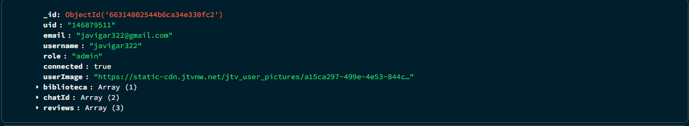
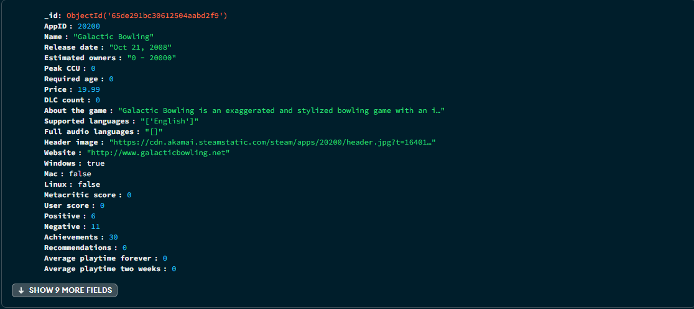
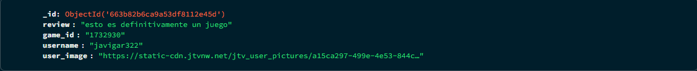
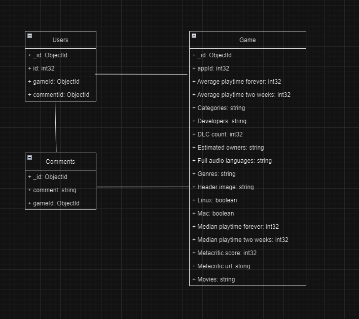

:::note
El esquema de la base de datos es provisional y puede sufrir cambios durante
el desarrollo de la aplicación.
:::

En el continuo desarrollo de la aplicación web se hace uso de una
base de datos en mongoDB, una base de datos noSQL que facilita
la su uso con pocas tablas muy grandes como en este caso.

En la base de datos se hace uso de usuarios , reseñas,
y juegos para su completa funcionalidad , con estas tres
tablas o colecciones que es como se conoce se puede
usar la aplicación web sin problema alguno.

## Usuarios

Cuando un usuario se registra a través de terceros como puede
ser twitch, cuando ocurre esto se crea un usuario en la base
de datos que guarda los juegos que ha añadido o las reseñas
que ha hecho.

## Juegos

La tabla de juegos que se usa se puede encontrar
en [internet](https://www.kaggle.com/datasets/fronkongames/steam-games-dataset)
y proporciona alrededor de 85.000 juegos para hacer
uso de ellos sin problemas y trae el nombre, id ,
géneros entre otros.

## Reseñas

las reseñas son necesarias para comentar que le ha parecido
a cada usuario el videojuego que ha añadido a su biblioteca
en la base de datos se guarda el juego de la reseña y su
usuario , ademas en la tabla de usuarios se guarda también
el juego para saber si lo ha reseñado ya o no.

## Esquema

El esquema se vería así , no tienes relaciones
al ser una base de datos no relacional.

